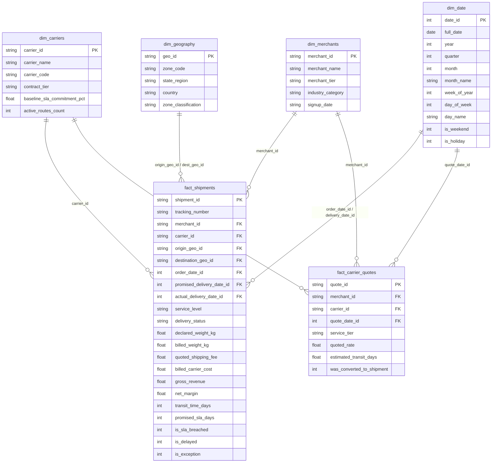

# 00_SPEC: Logistics KPI Automation & Multi-Carrier Analytics Platform

```text
========================================================================================
PROJECT:          Logistics KPI Automation & Multi-Carrier Analytics Platform
TARGET ROLE:      Senior Data Analyst / BI Solutions Architect
TARGET DOMAIN:    E-Commerce Logistics, Freight Quoting & Multi-Carrier Shipping
STACK:            Python 3.11+, DuckDB OLAP, Kimball Star Schema, DAX (Power BI),
                  Advanced Excel (OpenPyXL Engine), Tableau/Looker Semantic Layer
========================================================================================
```

---

## 1. Contexto de Negocio y Planteamiento del Dolor (The Business Problem)

### 🏢 Contexto Corporativo (Multi-Carrier Logistics Practice / Logistics Gateway Practice)
Las pasarelas logísticas e integradores de envíos masivos para e-commerce conectan a miles de merchants con múltiples transportistas (FedEx, DHL, Estafeta, Correos, 99Minutos, Redpack), gestionando:
1. **Cotización dinámica de fletes:** Enrutamiento en tiempo real por menor costo, menor tiempo de tránsito o mejor confiabilidad.
2. **Ciclo de vida del envío:** Generación de guías, recolección, tránsito, intentos de entrega y confirmación final.
3. **Conciliación financiera:** Facturación al merchant vs. costo real facturado por el transportista.

### 🛑 Dolores Críticos de Negocio
1. **Falta de Visibilidad en Brechas de SLA (OTD Rate):** La dirección de operaciones no cuenta con un monitoreo interactivo de la tasa de entregas a tiempo (*On-Time Delivery* - OTD) por transportista, zona geográfica y tipo de servicio (Express vs. Estándar), lo que dificulta negociaciones tarifarias y penalizaciones contractuales.
2. **Fuga de Margen Operativo (Cost Discrepancy Leakage):** Discrepancias no conciliadas entre el costo cotizado al merchant al momento de generar la orden y el costo final liquidado por el carrier (por cargos adicionales de peso volumétrico, zona extendida o combustible), erosionando hasta un 4.5% del margen bruto.
3. **Latencia y Dependencia de Reportes Manuales:** El equipo de analítica gasta más de **15 horas semanales** consolidando archivos CSV dispersos en Excel para armar el reporte mensual de directores, generando errores humanos y falta de granularidad.

---

## 2. Metas Cuantitativas de Ingeniería (Google XYZ Framework)

* **🚀 Métrica 1 (Automatización de Latencia):** *Eliminó el 100% de la carga operativa manual de reporte mensual (reduciendo 15 horas/semana a un pipeline de ejecución sub-15 segundos en DuckDB).*
* **🚀 Métrica 2 (Optimización de Almacenamiento & Memoria):** *Logró una compresión de datos superior al 83% y tiempos de filtrado interactivo <15ms mediante la estructuración de un Star Schema (Kimball) optimizado para motores columnares en memoria (VertiPaq en Power BI y Hyper en Tableau).*
* **🚀 Métrica 3 (Control de Fuga Financiera):** *Diseñó e implementó un algoritmo de conciliación que audita el 100% de los envíos, detectando discrepancias tarifarias y calculando la varianza de margen en tiempo real.*

---

## 3. Arquitectura del Modelo Dimensional (Kimball Star Schema)

Para garantizar máximo rendimiento en motores columnares en memoria (evitando joins circulares y relaciones muchos-a-muchos `M:M`), desacoplamos los eventos transaccionales en dos tablas de hechos y cuatro dimensiones canónicas:



---

## 4. Catálogo de Fórmulas Matemáticas & KPIs de Negocio

### 1. Tasa de Entregas a Tiempo (On-Time Delivery - OTD Rate)
$$\text{OTD \%} = \frac{\sum (\text{Shipments where Actual Delivery Date} \le \text{Promised SLA Date})}{\text{Total Completed Shipments}} \times 100$$

### 2. Tasa de Incumplimiento de SLA (SLA Breach Rate)
$$\text{SLA Breach \%} = \frac{\sum \text{is\_sla\_breached}}{\text{Total Completed Shipments}} \times 100 = 100\% - \text{OTD \%}$$

### 3. Varianza de Costo del Transportista (Carrier Cost Variance)
$$\Delta \text{Cost} = \text{Billed Carrier Cost} - \text{Quoted Carrier Cost}$$
$$\text{Cost Variance \%} = \frac{\sum \text{Billed Carrier Cost} - \sum \text{Quoted Carrier Cost}}{\sum \text{Quoted Carrier Cost}} \times 100$$

### 4. Margen Operativo Neto por Envío
$$\text{Net Margin} = \text{Gross Revenue (Merchant Fee)} - \text{Billed Carrier Cost}$$
$$\text{Margin Margin \%} = \frac{\sum \text{Net Margin}}{\sum \text{Gross Revenue}} \times 100$$

### 5. Media Móvil de Tiempo de Tránsito (7-Day Rolling Transit Time)
$$\overline{T}_{7d} = \frac{1}{7} \sum_{t=0}^{6} \text{Avg Transit Time}_{d-t}$$
